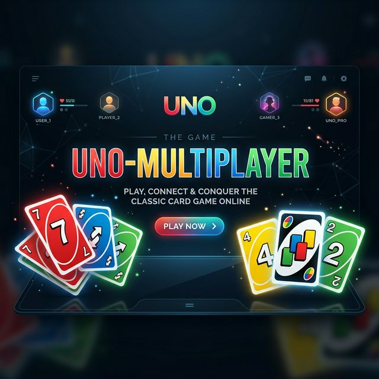

# UNO Show 'Em No Mercy - Multiplayer



**UNO Show 'Em No Mercy** est une adaptation multijoueur en temps reel du jeu de cartes officiel Mattel (HWV18, 2023). Version hardcore du UNO classique avec des regles sans pitie, de nouvelles cartes devastatrices, et un systeme d'elimination.

> **2 a 6 joueurs** | **168 cartes** | **Pas de pitie.**

---

## But du jeu

Etre le premier a se debarrasser de toutes ses cartes en main **OU** eliminer tous les autres joueurs.

---

## Le Deck : 168 cartes

### Cartes numerotees (108 cartes)

| Carte | Couleurs | Quantite | Regle |
|-------|----------|----------|-------|
| **0** | Rouge, Bleu, Vert, Jaune | 1 par couleur (4 total) | **Rotation** : tous les joueurs passent leur main au joueur suivant dans le sens du jeu |
| **1-9** | Rouge, Bleu, Vert, Jaune | 3 par couleur (108 total) | Jouable si meme couleur ou meme numero |
| **7** | Rouge, Bleu, Vert, Jaune | 3 par couleur (12 total) | **Echange** : le joueur DOIT echanger sa main avec un joueur de son choix |

> Les cartes 7 et 0 ont un effet special en plus d'etre jouables normalement.

---

### Cartes Action colorees (40 cartes)

| Carte | Symbole | Couleurs | Quantite | Effet |
|-------|---------|----------|----------|-------|
| **Skip** | Cercle barre | 4 couleurs | 2/couleur (8) | Le joueur suivant perd son tour |
| **Reverse** | Fleches inversees | 4 couleurs | 2/couleur (8) | Inverse le sens du jeu. **A 2 joueurs** : agit comme Skip (tu rejoues) |
| **+2** | +2 | 4 couleurs | 2/couleur (8) | Le joueur suivant pioche 2 cartes et perd son tour |
| **+4** | +4 | 4 couleurs | 2/couleur (8) | Le joueur suivant pioche 4 cartes et perd son tour |
| **Discard All** | Eventail de cartes | 4 couleurs | 1/couleur (4) | Tu poses TOUTES tes cartes de la meme couleur d'un coup |
| **Skip Everyone** | Cercle barre + ALL | 4 couleurs | 1/couleur (4) | Passe le tour de TOUS les autres joueurs, tu rejoues |

---

### Cartes Blanches / Wild (16 cartes)

Ces cartes n'ont pas de couleur — tu choisis la couleur en les jouant.

| Carte | Quantite | Effet |
|-------|----------|-------|
| **White Reverse +4** | 4 | Inverse le sens + le joueur suivant pioche 4 et perd son tour. **A 2 joueurs** : l'adversaire passe mais c'est TOI qui pioches 4 ! Tu peux alors stacker pour rediriger la penalite |
| **White +6** | 4 | Le joueur suivant pioche 6 cartes et perd son tour |
| **White +10** | 4 | Le joueur suivant pioche 10 cartes et perd son tour |
| **Color Roulette** | 4 | Le joueur suivant choisit une couleur, puis pioche de la PIOCHE carte par carte jusqu'a obtenir cette couleur (les cartes blanches ne comptent pas) |

---

## Regles speciales No Mercy

### 1. Penalite augmentee (Stacking)

Quand une carte +X est jouee, le joueur suivant peut repondre avec une carte +X de **valeur egale ou superieure**. La penalite s'accumule.

```
Joueur A joue +2 (total: 2)
  -> Joueur B joue +4 (total: 6)
    -> Joueur C joue +6 (total: 12)
      -> Joueur D ne peut pas repondre -> pioche 12 cartes !
```

| Si la derniere carte est... | Tu peux repondre avec... |
|-----------------------------|--------------------------|
| +2 | +2, +4, +6, ou +10 |
| +4 | +4, +6, ou +10 |
| +6 | +6 ou +10 |
| +10 | +10 uniquement |

### 2. Elimination (Pitie)

Quand un joueur a **25 cartes ou plus** en main, il est **elimine du jeu**. Ses cartes sont mises de cote et reutilisees quand la pioche est epuisee.

> C'est la raison pour laquelle le +10 est si devastateur — il peut directement eliminer quelqu'un !

### 3. Regle du 7 — Echange obligatoire

Quand tu joues un **7** (n'importe quelle couleur), tu **DOIS** echanger ta main avec un joueur de ton choix.

**Strategie :** Echange avec le joueur qui a le moins de cartes pour le pieger, ou debarrasse-toi d'une mauvaise main.

### 4. Regle du 0 — Rotation globale

Quand tu joues un **0** (n'importe quelle couleur), **TOUS** les joueurs passent leur main au joueur suivant dans le sens du jeu.

> Chaos garanti.

### 5. Pioche jusqu'a jouable

Si tu n'as pas de carte jouable, tu pioches de la PIOCHE **jusqu'a obtenir une carte jouable**, puis tu la joues.

### 6. Annoncer UNO

Quand il te reste **1 seule carte**, tu dois annoncer **"UNO!"**. Si un adversaire te denonce avant le debut du tour suivant, tu pioches **2 cartes** de penalite.

### 7. Conditions de victoire

- **Main vide** : tu poses ta derniere carte = tu gagnes
- **Dernier survivant** : tous les autres joueurs sont elimines = tu gagnes

---

## Fonctionnalites du jeu

### Multijoueur en temps reel
- 2 a 6 joueurs par room
- Codes de room a 4 lettres
- Synchronisation Socket.io

### Chat en jeu
- Messagerie en temps reel entre joueurs
- Badge de notification pour les messages non lus

### Emojis de reaction
5 emojis pour troller ou exprimer tes emotions :

| Emoji | Usage |
|-------|-------|
| :joy: | Quand quelqu'un se fait stacker |
| :rage: | Quand tu pioches 10 cartes |
| :skull: | Quand c'est game over |
| :fire: | Move strategique |
| :clown: | Pour le troll |

### Effets sonores
- **FAHHH** quand un +10 est joue (2 secondes du meme)

### Confetti
- Explosion de confetti quand un joueur gagne la partie

---

## Tech Stack

| Composant | Technologie |
|-----------|-------------|
| Frontend | HTML5, CSS3, Vanilla JavaScript |
| Backend | Node.js + Express |
| Temps reel | Socket.io |
| Game Engine | Module standalone (`engine/`) avec tests automatises |

---

## Quick Start

### 1. Installation
```bash
git clone <repo-url>
cd Uno-Multiplayer
npm install
```

### 2. Lancer le serveur
```bash
node sMain.js
```
Ouvre `http://localhost:3000` dans ton navigateur.

### 3. Jouer en reseau (optionnel)
```bash
./createTunnel.sh 3000 <nom-custom>
```
Partage l'URL generee a tes amis.

---

## Architecture

```
Uno-Multiplayer/
|-- sMain.js                 Serveur Express + Socket.io
|-- sMainMenu.js             Logique menu / rooms
|-- sGame.js                 Logique de jeu serveur
|-- sCardGenerator.js        Deck 168 cartes officiel
|-- sGameCache.js            Cache de sessions
|-- engine/                  Game engine standalone
|   |-- cards.js             Definitions + deck builder
|   |-- gameState.js         Helpers d'etat immutables
|   |-- gameEngine.js        Moteur complet (10 fonctions)
|   |-- gameReducer.js       Reducer pattern
|   |-- test.js              90 tests automatises
|-- public/
|   |-- index.html           Menu principal
|   |-- game.html            Page de jeu
|   |-- MainMenu/            CSS + JS du menu
|   |-- Game/
|       |-- game.js          Logique client
|       |-- card.js          Rendu des cartes
|       |-- game.css          Styles du jeu
|       |-- Images/           124 SVGs (toutes les cartes)
|       |-- Sounds/           Effets sonores
```

---

## Tableau recapitulatif des 168 cartes

| Type | Couleur | Quantite | Total |
|------|---------|----------|-------|
| 0 | R/B/G/Y | 1 chacun | 4 |
| 1-9 | R/B/G/Y | 3 chacun | 108 |
| Skip | R/B/G/Y | 2 chacun | 8 |
| Reverse | R/B/G/Y | 2 chacun | 8 |
| +2 | R/B/G/Y | 2 chacun | 8 |
| +4 | R/B/G/Y | 2 chacun | 8 |
| Discard All | R/B/G/Y | 1 chacun | 4 |
| Skip Everyone | R/B/G/Y | 1 chacun | 4 |
| White Reverse +4 | Wild | 4 | 4 |
| White +6 | Wild | 4 | 4 |
| White +10 | Wild | 4 | 4 |
| Color Roulette | Wild | 4 | 4 |
| | | **TOTAL** | **168** |

---

## Points (methode optionnelle)

| Carte | Points |
|-------|--------|
| Numerotees (0-9) | Valeur indiquee |
| Action coloree (Skip, Reverse, +2, +4, Discard All, Skip Everyone) | 20 points |
| Carte blanche (Reverse+4, +6, +10, Color Roulette) | 50 points |
| Bonus elimination | 250 points par joueur elimine |

Premier joueur a **1000 points** gagne la partie complete.

---

## Problemes connus

- Les joueurs dans une meme room doivent avoir des noms **uniques**
- Le game engine (`engine/`) n'est pas encore connecte au frontend Socket.io (le frontend utilise `sGame.js`)

---

## Licence

MIT License. Voir [LICENSE](LICENSE).

---

Basee sur les regles officielles **UNO Show 'Em No Mercy** (Mattel HWV18, 2023).
